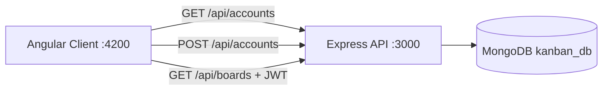
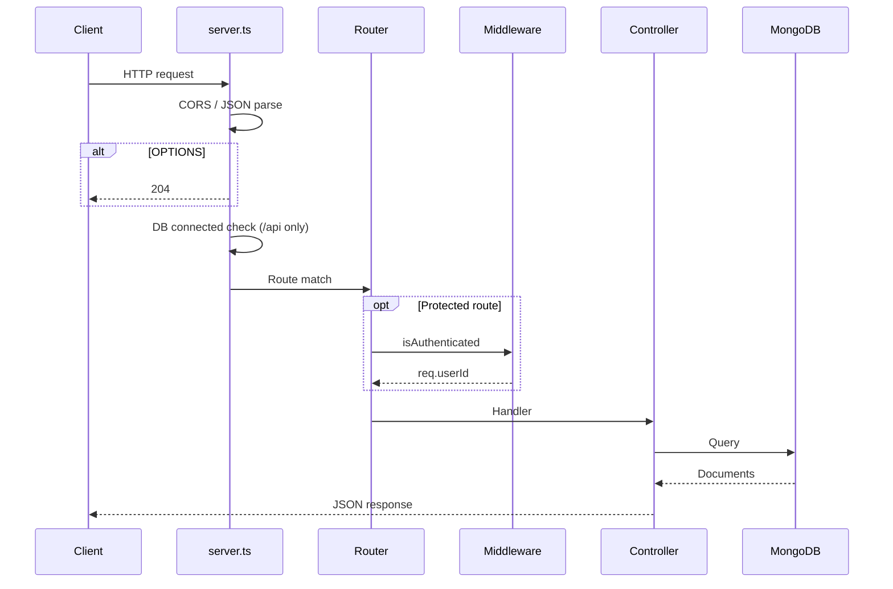
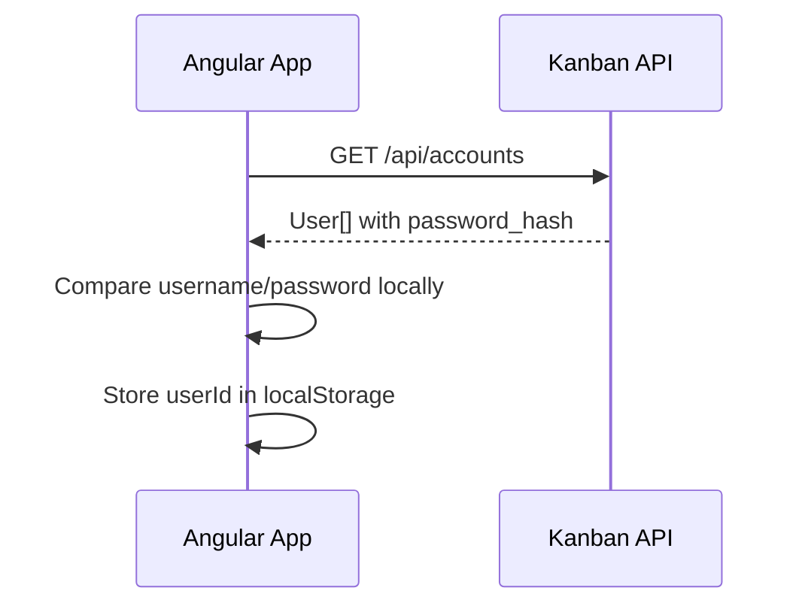
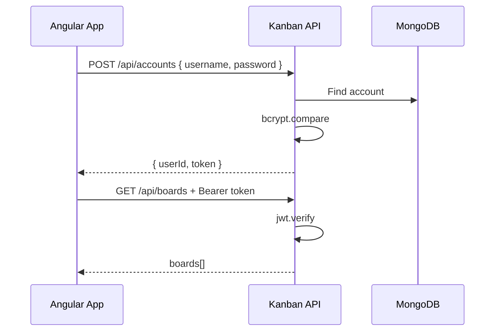
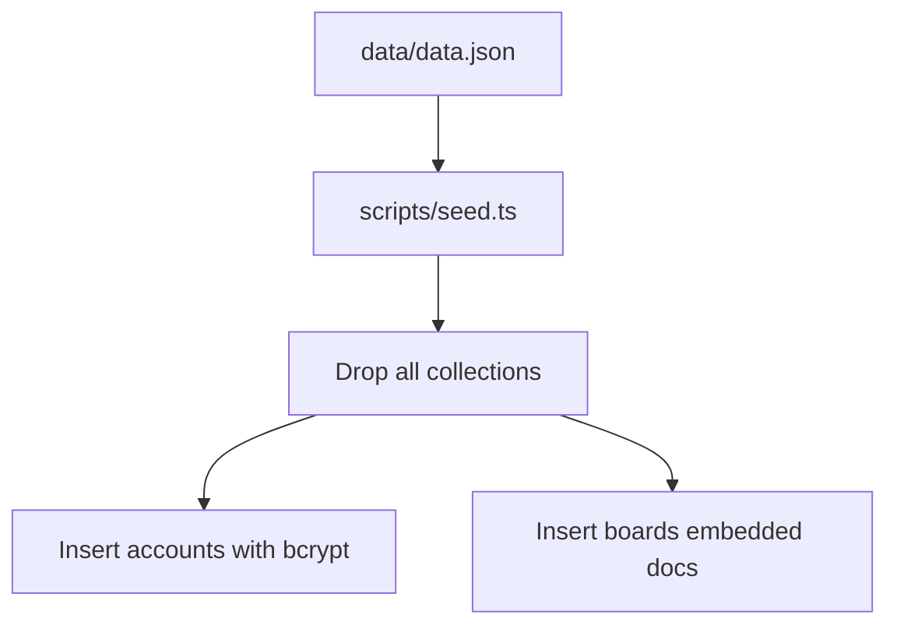

# Architecture

Overview of how the Kanban API is structured, how data flows, and how authentication works.

---

## High-Level Overview



---

## Inline Code Documentation

Every source file includes **JSDoc comments** above classes, interfaces, functions, and key middleware blocks. New contributors should read:

- `src/server.ts` — startup, CORS, and error handling
- `src/controllers/` — what each endpoint does
- `src/middleware/check-auth.ts` — how JWT protection works
- `scripts/seed.ts` — how seeding clears and reloads the database

---

## Layered Design

The codebase follows a simple three-layer pattern (same style as cereal-backend):

```
HTTP Request
    ↓
routes/          → URL mapping, middleware chain
    ↓
controllers/     → Validation, business logic, response shape
    ↓
models/          → Mongoose schemas and MongoDB access
```

| Layer | Responsibility |
|-------|----------------|
| **server.ts** | App bootstrap, global middleware, CORS, error handler, MongoDB connection |
| **routes** | Mount paths under `/api/accounts` and `/api/boards` |
| **controllers** | Async handlers; use `HttpError` + `next(error)` |
| **models** | `Account` and `Board` collections |
| **middleware** | JWT verification (`isAuthenticated`) |
| **http-error** | `HttpError` class with HTTP status `code` |

There is no separate `services/` layer; controllers talk to Mongoose directly.

---

## Request Lifecycle



---

## Data Model

### Account (`accounts` collection)

| Field | Type | Notes |
|-------|------|-------|
| `userId` | string | Unique business ID (from seed `id`) |
| `username` | string | Unique, lowercase |
| `passwordHash` | string | bcrypt hash (12 rounds) |

### Board (`boards` collection)

Boards use **embedded documents** for columns and tasks (no separate collections).

```
Board
├── boardId (number, unique)
├── name (string)
└── columns[]
    ├── columnId, name, position, boardId
    └── tasks[]
        └── taskId, title, description, assignee, columnId, position
```

### API vs database field names

| Database (camelCase) | API JSON (snake_case) |
|----------------------|------------------------|
| `boardId` | `id` |
| `columnId` | `id` |
| `boardId` (on column) | `board_id` |
| `columnId` (on task) | `column_id` |
| `taskId` | `id` |

Mapping happens in `board-controller.ts` via `mapBoardToApi`.

---

## Authentication Flows

The application supports **two login paths** for historical compatibility with the Angular frontend.

### 1. Client-side login (Angular)



- No JWT required for `GET /api/accounts`
- Passwords in the response come from `data/data.json` (plain text)

### 2. Server-side login (JWT)



- Passwords verified against bcrypt hashes in MongoDB
- `GET /api/boards` requires valid JWT

---

## Seeding



`GET /api/accounts` reads from `data/data.json` via `src/utils/load-data.ts`, not from MongoDB, so the login UI stays in sync with the seed file.

---

## Error Handling

Custom errors use `HttpError`:

```typescript
throw new HttpError("Invalid username or password", 401);
// or
return next(new HttpError("...", 401));
```

Global handler in `server.ts` responds with:

```json
{ "success": false, "error": "<message>" }
```

---

## Module System

- **ESM** (`"type": "module"` in `package.json`)
- TypeScript compiles to `dist/` with `module: nodenext`
- Local imports use `.js` extensions (Node ESM resolution)

---

## Technology Stack

| Package | Purpose |
|---------|---------|
| express | HTTP server |
| mongoose | MongoDB ODM |
| jsonwebtoken | JWT sign/verify |
| bcryptjs | Password hashing |
| dotenv | Environment variables |
| chalk | Colored console logs |
| tsx | TypeScript execution in development |
| nodemon | File watch restart |

---

## Future Extensions

Suggested improvements (not yet implemented):

- Vitest unit/integration tests
- Move `GET /api/accounts` to read from MongoDB only
- Rate limiting and Helmet for production hardening
- CRUD endpoints for boards, columns, and tasks
